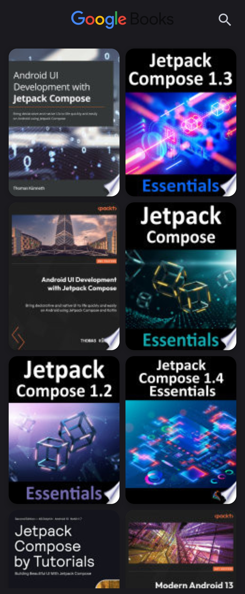
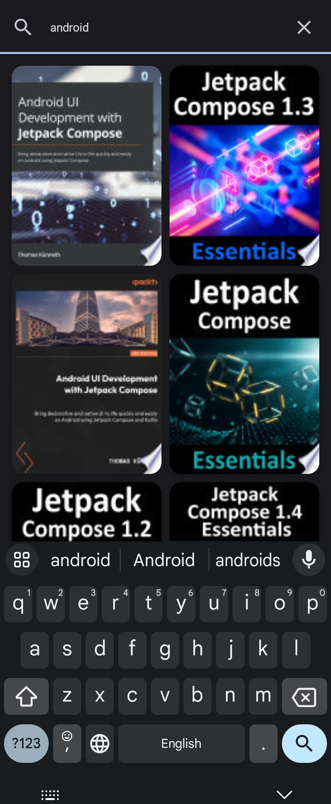
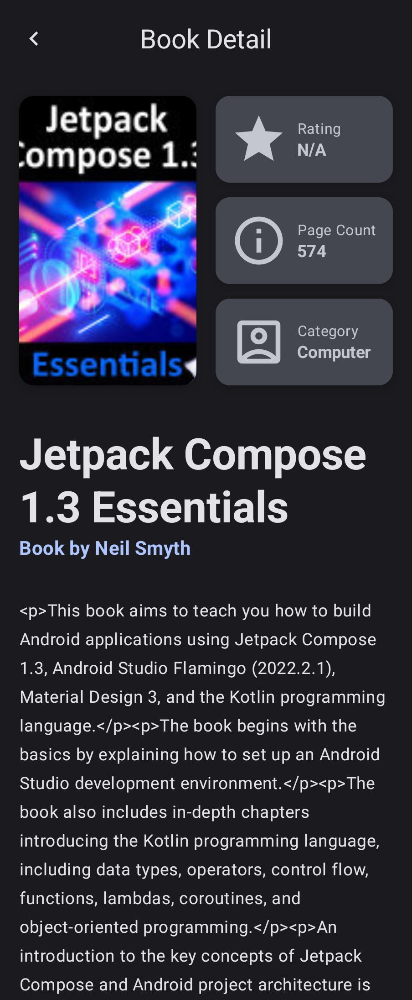
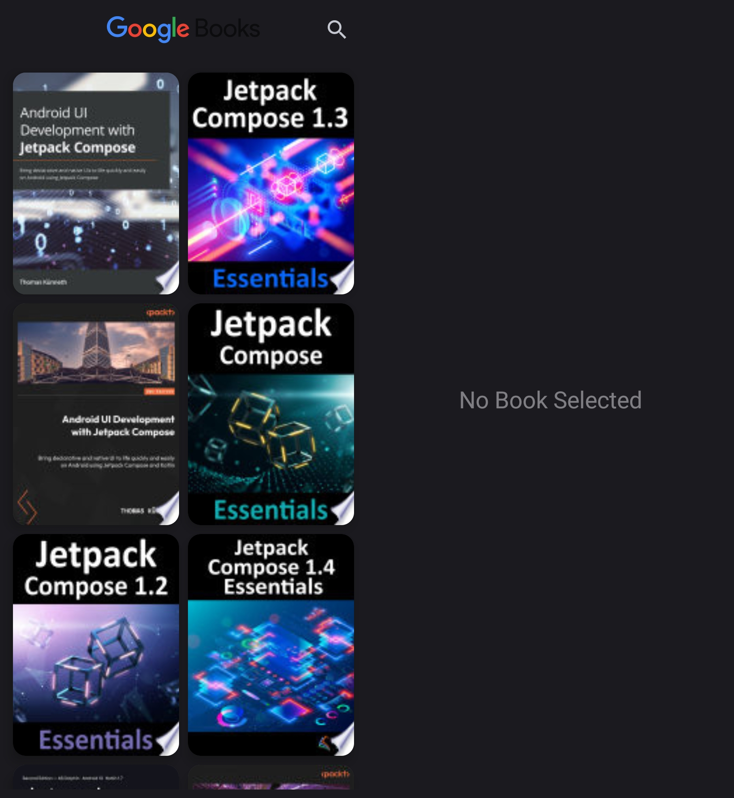
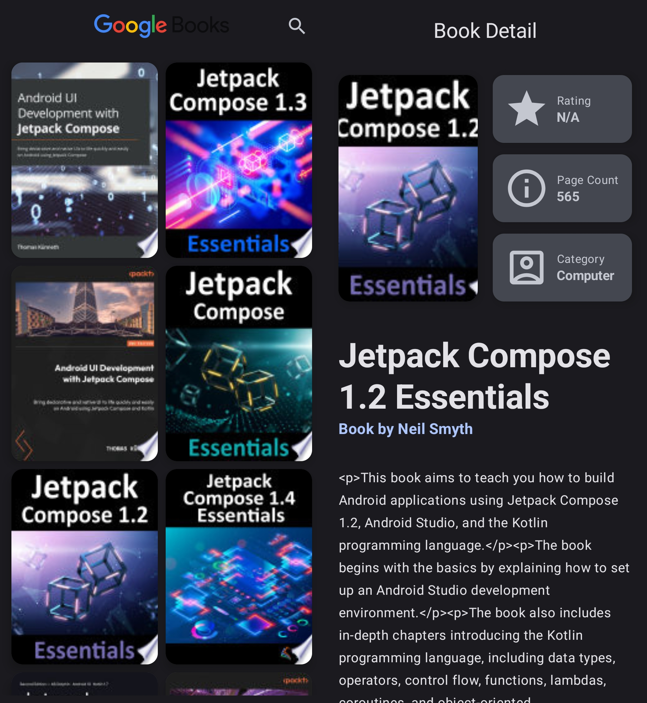
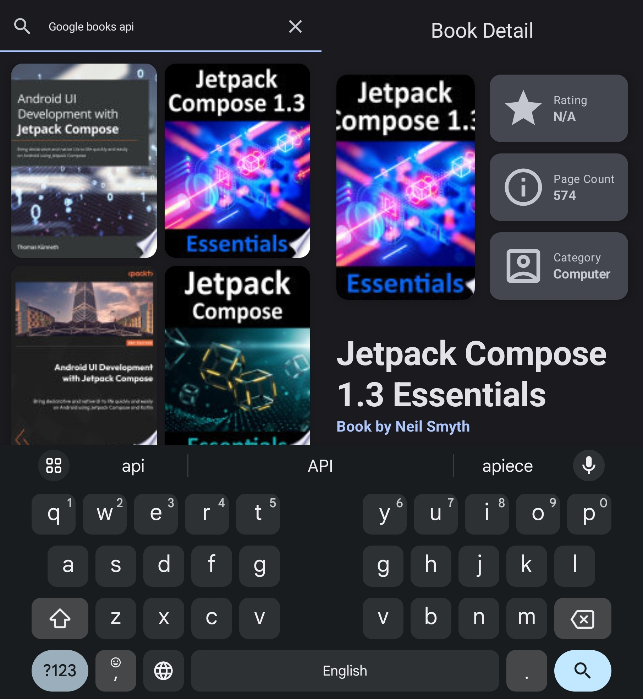

# Google Books App

Google Books app is a simple single activity app, built with [Jetpack Compose](https://developer.android.com/jetpack/compose). Implemented for [Android Basics with Compose](https://developer.android.com/courses/android-basics-compose/course?gclid=Cj0KCQjwhL6pBhDjARIsAGx8D58SHppQqhpwLWxdJIKkCGvetM6-PhaNQWWuqPMQ39RFgbFOorLF64waAsYjEALw_wcB&gclsrc=aw.ds) Course, [Unit 5](https://developer.android.com/courses/android-basics-compose/unit-5), [Pathway 2](https://developer.android.com/courses/android-basics-compose/unit-5) Project [Create a Bookshelf App](https://developer.android.com/codelabs/basic-android-kotlin-compose-bookshelf). Added features: Search, book detailed view, support for all device sizes.

Google Books app architecture closely follows [Guide to android app architecture](https://developer.android.com/topic/architecture).

Main Takeaways of this app:
- RESTful API usage
- Adaptive layout for mobile, tablets and foldables
- Domain Layer
- Architecture
- Dependency Injection
- Unit Testing

## Screenshots
### Compact Width

  
  
  

### Medium Width

  
  
  

## Features
This app has two screen, Book Home Screen, where user can search for books and choose them. If a book is chosen Book Detail Screen appears, where user can see books detailed info

### App Scaffolding

Package [`com.example.googlebooks`](app/src/main/java/com/example/googlebooks)

[`MainActivity`](app/src/main/java/com/example/googlebooks/MainActivity.kt) is the application's entry point. Only dynamic navigation is used. [GoogleBooksHomeScreen](app/src/main/java/com/example/googlebooks/ui/screens/books/GoogleBooksHomeScreen.kt) is the default screen. all screens share the same viewmodel [GoogleBooksViewModel](app/src/main/java/com/example/googlebooks/ui/screens/GoogleBooksViewModel.kt).

### Need to Revisit
- Response of API consists of description, which is in html, which needs to be parsed and displayed properly
- Better UI could be designed, my designing skills are not the best
- Paging could be added
- BookDetailScreen could show my details, or another screen could be added for details
- Feature Favorites can be added
- Feature add to cart could be added

